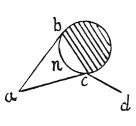

  
[Intangible Textual Heritage](../../index)  [Age of Reason](../index.md) 
[Index](index.md)   
[III. Six Books on Light and Shade Index](dvs002.md)  
  [Previous](0132)  [Next](0134.md) 

------------------------------------------------------------------------

[Buy this Book at
Amazon.com](https://www.amazon.com/exec/obidos/ASIN/0486225720/internetsacredte.md)

------------------------------------------------------------------------

*The Da Vinci Notebooks at Intangible Textual Heritage*

### 133.

 

### OF THE HIGHEST LIGHTS WHICH TURN AND MOVE AS THE EYE MOVES WHICH SEES THE OBJECT.

Suppose the body to be the round object figured here and let the light
be at the point *a*, and let the illuminated side of the object be *b c*
and the eye at the point *d*: I say that, as lustre is every where and
complete in each part, if you stand at the point *d* the lustre will
appear at *c*, and in proportion as the eye moves from *d* to *a*, the
lustre will move from *c* to *n*.

------------------------------------------------------------------------

[Next: 134.](0134.md)
