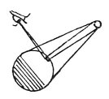

  
[Intangible Textual Heritage](../../index)  [Age of Reason](../index) 
[Index](index)   
[III. Six Books on Light and Shade Index](dvs002)  
  [Previous](0133)  [Next](0135) 

------------------------------------------------------------------------

[Buy this Book at
Amazon.com](https://www.amazon.com/exec/obidos/ASIN/0486225720/internetsacredte)

------------------------------------------------------------------------

*The Da Vinci Notebooks at Intangible Textual Heritage*

### 134.

 

### OF PAINTING.

Heigh light or lustre on any object is not situated \[necessarily\] in
the middle of an illuminated object, but moves as and where the eye
moves in looking at it.

------------------------------------------------------------------------

[Next: 135.](0135)
