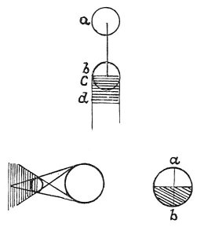

  
[Intangible Textual Heritage](../../index)  [Age of Reason](../index) 
[Index](index)   
[III. Six Books on Light and Shade Index](dvs002)  
  [Previous](0135)  [Next](0137) 

------------------------------------------------------------------------

[Buy this Book at
Amazon.com](https://www.amazon.com/exec/obidos/ASIN/0486225720/internetsacredte)

------------------------------------------------------------------------

*The Da Vinci Notebooks at Intangible Textual Heritage*

### 136.

 

 The relations of luminous to illuminated
bodies.The middle of the light and shade on an object in light
and shade is opposite to the middle of the primary light. All light and
shadow expresses itself in pyramidal lines. The middle of the shadow on
any object must necessarily be opposite the middle of its light, with a
direct line passing through the centre of the body. The middle of the
light will be at *a*, that of the shadow at *b*. \[Again, in bodies
shown in light and shade the middle of each must coincide with the
centre of the body, and a straight line will pass through both and
through that centre.\]

 [58](#fn_60)

------------------------------------------------------------------------

### Footnotes

[81:58](0136.htm#fr_60) : In the original MS.,
at the spot marked *a* of the first diagram Leonardo wrote *primitiuo*,
and at the spot marked *c*--*primitiva* (primary); at the spot marked
*b* he wrote *dirivatiuo* and at *d deriuatiua* (derived).

------------------------------------------------------------------------

[Next: 137.](0137)
