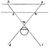

  
[Intangible Textual Heritage](../../index)  [Age of Reason](../index) 
[Index](index)   
[III. Six Books on Light and Shade Index](dvs002)  
  [Previous](0138)  [Next](0140) 

------------------------------------------------------------------------

[Buy this Book at
Amazon.com](https://www.amazon.com/exec/obidos/ASIN/0486225720/internetsacredte)

------------------------------------------------------------------------

*The Da Vinci Notebooks at Intangible Textual Heritage*

### 139.

p. 83

[  
Click to enlarge](img/v108300.jpg)

Every shadow with all its variations, which becomes larger as its
distance from the object is greater, has its external lines intersecting
in the middle, between the light and the object. This proposition is
very evident and is confirmed by experience. For, if *a b* is a window
without any object interposed, the luminous atmosphere to the right hand
at *a* is seen to the left at *d*. And the atmosphere at the left
illuminates on the right at *c*, and the lines intersect at the point
*m*.

 [61](#fn_63)

------------------------------------------------------------------------

### Footnotes

[83:61](0139.htm#fr_63) : *A* here stands for
*levante* (East), *B* for *ponente* (West).

------------------------------------------------------------------------

[Next: 140.](0140)
