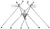

  
[Intangible Textual Heritage](../../index)  [Age of Reason](../index) 
[Index](index)   
[III. Six Books on Light and Shade Index](dvs002)  
  [Previous](0139)  [Next](0141) 

------------------------------------------------------------------------

[Buy this Book at
Amazon.com](https://www.amazon.com/exec/obidos/ASIN/0486225720/internetsacredte)

------------------------------------------------------------------------

*The Da Vinci Notebooks at Intangible Textual Heritage*

### 140.

[  
Click to enlarge](img/v108301.jpg)

Every body in light and shade is situated between 2 pyramids one dark
and the other luminous, one is visible the other is not. But this only
happens when the light enters by a window. Supposing *a b* to be the
window and *r* the body in light and shade, the light to the right hand
*z* will pass the object to the left and go on to *p*; the light to the
left at *k* will pass to the right of the object at *i* and

p. 84

go on to *m* and the two lines will intersect at *c* and form a pyramid.
Then again *a* *b* falls on the shaded body at *i* *g* and forms a
pyramid *f* *i* *g*. *f* will be dark because the light *a* *b* can
never fall there; *i* *g* *c* will be illuminated because the light
falls upon it.

------------------------------------------------------------------------

[Next: 141.](0141)
