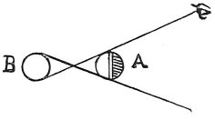

  
[Intangible Textual Heritage](../../index)  [Age of Reason](../index) 
[Index](index)   
[III. Six Books on Light and Shade Index](dvs002)  
  [Previous](0142)  [Next](0144) 

------------------------------------------------------------------------

[Buy this Book at
Amazon.com](https://www.amazon.com/exec/obidos/ASIN/0486225720/internetsacredte)

------------------------------------------------------------------------

*The Da Vinci Notebooks at Intangible Textual Heritage*

### 143.

 

A body in shadow situated between the light and the eye can never
display its illuminated portion unless the eye can see the whole of the
primary light.

 [64](#fn_66)

------------------------------------------------------------------------

### Footnotes

[84:64](0143.htm#fr_66) : *A* stands for *corpo*
(body), *B* for *lume* (light).

------------------------------------------------------------------------

[Next: 144.](0144)
