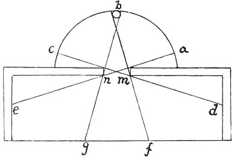

  
[Intangible Textual Heritage](../../index)  [Age of Reason](../index) 
[Index](index)   
[III. Six Books on Light and Shade Index](dvs002)  
  [Previous](0145)  [Next](0147) 

------------------------------------------------------------------------

[Buy this Book at
Amazon.com](https://www.amazon.com/exec/obidos/ASIN/0486225720/internetsacredte)

------------------------------------------------------------------------

*The Da Vinci Notebooks at Intangible Textual Heritage*

### 146.

 

 The law of the incidence of light.The
edges of a window which are illuminated by 2 lights of equal degrees of
brightness will not reflect light of equal brightness into the chamber
within.

If *b* is a candle and *a c* our hemisphere both will illuminate the
edges of the window *m* *n*, but light *b* will only illuminate *f g*
and the hemisphere *a* will light all of *d e*.

------------------------------------------------------------------------

[Next: 147.](0147)
