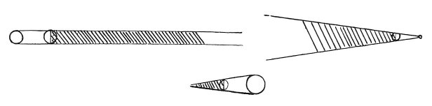

  
[Intangible Textual Heritage](../../index)  [Age of Reason](../index) 
[Index](index)   
[III. Six Books on Light and Shade Index](dvs002)  
  [Previous](0159)  [Next](0161) 

------------------------------------------------------------------------

[Buy this Book at
Amazon.com](https://www.amazon.com/exec/obidos/ASIN/0486225720/internetsacredte)

------------------------------------------------------------------------

*The Da Vinci Notebooks at Intangible Textual Heritage*

### 160.

### SHADOW AND LIGHT.

 Different sorts of derived shadows
(160-162).The forms of shadows are three: inasmuch as if the
solid body which casts the shadow is equal (in size) to the light, the
shadow resembles

 

a column without any termination (in length). If the body is larger than
the light the shadow resembles a truncated and inverted pyramid, and its
length has also no defined termination. But if the body is smaller than
the light, the shadow will resemble a pyramid and come to an end, as is
seen in eclipses of the moon.

------------------------------------------------------------------------

[Next: 161.](0161)
