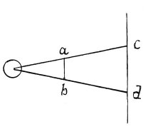

  
[Intangible Textual Heritage](../../index)  [Age of Reason](../index.md) 
[Index](index.md)   
[III. Six Books on Light and Shade Index](dvs002.md)  
  [Previous](0163)  [Next](0165.md) 

------------------------------------------------------------------------

[Buy this Book at
Amazon.com](https://www.amazon.com/exec/obidos/ASIN/0486225720/internetsacredte.md)

------------------------------------------------------------------------

*The Da Vinci Notebooks at Intangible Textual Heritage*

### 164.

 

### HOW A CAST SHADOW CAN NEVER BE OF THE SAME SIZE AS THE BODY THAT CASTS IT.

If the rays of light proceed, as experience shows, from a single point
and are diffused in a sphere round this point, radiating and dispersed
through the air, the farther they spread the wider they must spread; and
an object placed between the light and a wall is always imaged larger in
its shadow, because the rays that strike it  [71](#fn_73.md) would, by the time they have reached the
wall, have become larger.

------------------------------------------------------------------------

### Footnotes

[94:71](0164.htm#fr_73.md) : 7. The following lines
are wanting to complete the logical connection.

------------------------------------------------------------------------

[Next: 165.](0165.md)
