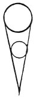

  
[Intangible Textual Heritage](../../index)  [Age of Reason](../index.md) 
[Index](index.md)   
[III. Six Books on Light and Shade Index](dvs002.md)  
  [Previous](0164)  [Next](0166.md) 

------------------------------------------------------------------------

[Buy this Book at
Amazon.com](https://www.amazon.com/exec/obidos/ASIN/0486225720/internetsacredte.md)

------------------------------------------------------------------------

*The Da Vinci Notebooks at Intangible Textual Heritage*

### 165.

 

Any shadow cast by a body in light and shade is of the same nature and
character as that which is inseparable from the body. The centre of the
length of a shadow always corresponds to that of the luminous body
 [72](#fn_74.md) . It is inevitable that every
shadow must have its centre in a line with the centre of the light.

On the shape of derived shadows (166-174).

------------------------------------------------------------------------

### Footnotes

[94:72](0165.htm#fr_74.md) 6: This second statement
of the same idea as in the former sentence, but in different words, does
not, in the original, come next to the foregoing; sections 172 and 127
are placed between them.

------------------------------------------------------------------------

[Next: 166.](0166.md)
