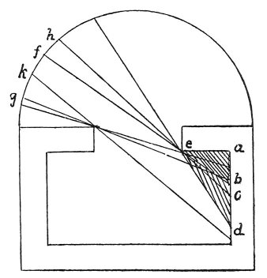

  
[Intangible Textual Heritage](../../index)  [Age of Reason](../index) 
[Index](index)   
[III. Six Books on Light and Shade Index](dvs002)  
  [Previous](0170)  [Next](0172) 

------------------------------------------------------------------------

[Buy this Book at
Amazon.com](https://www.amazon.com/exec/obidos/ASIN/0486225720/internetsacredte)

------------------------------------------------------------------------

*The Da Vinci Notebooks at Intangible Textual Heritage*

### 171.

 

### OF PAINTING.

Of different shadows of equal strength that which is nearest the eye
will seem the least strong.

Why is the shadow *e a b* in the first grade of strength, *b c* in the
second; *c d* in the third? The reason is that as from *e a b* the sky
is nowhere visible, it gets no light whatever from the sky, and so has
no direct \[primary\] light. *b c* faces the portion of the sky *f*

p. 97

*g* and is illuminated by it. *c d* faces the sky at *h k*. *c d*, being
exposed to a larger extent of sky than *b c*, it is reasonable that it
should be more lighted. And thus, up to a certain distance, the wall *a
d* will grow lighter for the reasons here given, until the darkness of
the room overpowers the light from the window.

------------------------------------------------------------------------

[Next: 172.](0172)
