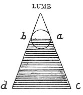

  
[Intangible Textual Heritage](../../index)  [Age of Reason](../index) 
[Index](index)   
[III. Six Books on Light and Shade Index](dvs002)  
  [Previous](0176)  [Next](0178) 

------------------------------------------------------------------------

[Buy this Book at
Amazon.com](https://www.amazon.com/exec/obidos/ASIN/0486225720/internetsacredte)

------------------------------------------------------------------------

*The Da Vinci Notebooks at Intangible Textual Heritage*

### 177.

 

*a b* will be darker than *c d* in proportion as *c d* is broader than
*a b*.

 [80](#fn_82)

------------------------------------------------------------------------

### Footnotes

[99:80](0177.htm#fr_82) : In the original MS.
the word *lume* (light) is written at the apex of the pyramid.

------------------------------------------------------------------------

[Next: 178.](0178)
