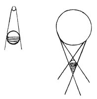

  
[Intangible Textual Heritage](../../index)  [Age of Reason](../index) 
[Index](index)   
[III. Six Books on Light and Shade Index](dvs002)  
  [Previous](0180)  [Next](0182) 

------------------------------------------------------------------------

[Buy this Book at
Amazon.com](https://www.amazon.com/exec/obidos/ASIN/0486225720/internetsacredte)

------------------------------------------------------------------------

*The Da Vinci Notebooks at Intangible Textual Heritage*

### 181.

 

A light which is smaller than the body it illuminates produces shadows
of which the outlines end within \[the surface of\] the body, and not
much compound shadow; and falls on less than half of it. A light which
is larger than the body it illuminates, falls on more than half of it,
and produces much compound shadow.

------------------------------------------------------------------------

[Next: 182.](0182)
