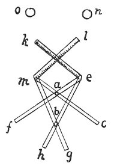

  
[Intangible Textual Heritage](../../index)  [Age of Reason](../index) 
[Index](index)   
[III. Six Books on Light and Shade Index](dvs002)  
  [Previous](0183)  [Next](0185) 

------------------------------------------------------------------------

[Buy this Book at
Amazon.com](https://www.amazon.com/exec/obidos/ASIN/0486225720/internetsacredte)

------------------------------------------------------------------------

*The Da Vinci Notebooks at Intangible Textual Heritage*

### 184.

### OF SIMPLE SHADOWS.

 

Why, at the intersections *a*, *b* of the two compound shadows *e f* and
*m e*, is a simple shadow pfoduced as at *e h* and *m g*, while no such
simple shadow is produced at the other two intersections *c d* made by
the very same compound shadows?

### ANSWER.

Compound shadow are a mixture of light and shade and simple shadows are
simply darkness. Hence, of the two lights *n* and *o*, one falls on the
compound shadow from one side, and the other on the compound shadow from
the other side, but where they intersect no light falls, as at *a b*;
therefore it is a simple shadow. Where there is a compound shadow one
light or the other falls; and here a difficulty arises for my adversary
since he says that, where the compound shadows intersect, both the
lights which produce the shadows must of necessity fall and therefore
these shadows ought to be neutralised; inasmuch as the two lights do not
fall there, we say that the shadow is a simple one and where only one of
the two lights falls, we say the shadow is compound, and where both the
lights fall the shadow is neutralised; for where both lights fall, no
shadow of any kind is produced, but only a light background limiting the
shadow. Here I shall say that what my adversary said was true: but he
only mentions such truths as are in his favour; and if we go on to the
rest he must conclude that my proposition is true. And that is: That if
both lights fell on the

p. 104

point of intersection, the shadows would be neutralised. This I confess
to be true if \[neither of\] the two shadows fell in the same spot;
because, where a shadow and a light fall, a compound shadow is produced,
and wherever two shadows or two equal lights fall, the shadow cannot
vary in any part of it, the shadows and the lights both being equal. And
this is proved in the eighth \[proposition\] on proportion where it is
said that if a given quantity has a single unit of force and resistance,
a double quantity will have double force and double resistance.

------------------------------------------------------------------------

[Next: 185.](0185)
