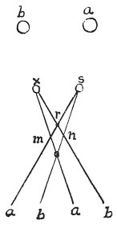

  
[Intangible Textual Heritage](../../index)  [Age of Reason](../index) 
[Index](index)   
[III. Six Books on Light and Shade Index](dvs002)  
  [Previous](0184)  [Next](0186) 

------------------------------------------------------------------------

[Buy this Book at
Amazon.com](https://www.amazon.com/exec/obidos/ASIN/0486225720/internetsacredte)

------------------------------------------------------------------------

*The Da Vinci Notebooks at Intangible Textual Heritage*

### 185.

 

### DEFINITION.

The intersection *n* is produced by the shadows caused by the light *b*,
because this light *b* produces the shadow *x b*, and the shadow *s b*,
but the intersection *m* is produced by the light *a* which causes the
shadow *s a*, and the shadow *x a*.

But if you uncover both the lights *a b*, then you get the two shadows
*n m* both at once, and besides these, two other, simple shadows are
produced at *r o* where neither of the two lights falls at all. The
grades of depth in compound shadows are fewer in proportion as the
lights falling on, and crossing them are less numerous.

------------------------------------------------------------------------

[Next: 186.](0186)
