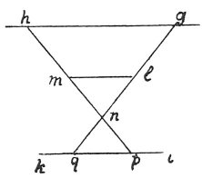

  
[Intangible Textual Heritage](../../index)  [Age of Reason](../index) 
[Index](index)   
[III. Six Books on Light and Shade Index](dvs002)  
  [Previous](0198)  [Next](0200) 

------------------------------------------------------------------------

[Buy this Book at
Amazon.com](https://www.amazon.com/exec/obidos/ASIN/0486225720/internetsacredte)

------------------------------------------------------------------------

*The Da Vinci Notebooks at Intangible Textual Heritage*

### 199.

p. 111

 

### OF THE OPINION OF SOME THAT A TRIANGLE CASTS NO SHADOW ON A PLANE SURFACE.

 A disputed proposition.Certain
mathematicians have maintained that a triangle, of which the base is
turned to the light, casts no shadow on a plane; and this they prove by
saying \[5\] that no spherical body smaller than the light can reach the
middle with the shadow. The lines of radiant light are straight lines
\[6\]; therefore, suppose the light to be *g h* and the triangle *l m
n*, and let the plane be *i k*; they say the light *g* falls on the side
of the triangle *l n*, and the portion of the plane *i q*. Thus again
*h* like *g* falls on the side *l m*, and then on *m n* and the plane *p
k*; and if the whole plane thus faces the lights *g h*, it is evident
that the triangle has no shadow; and that which has no shadow can cast
none. This, in this case appears credible. But if the triangle *n p g*
were not illuminated by the two lights *g* and *h*, but by *i p* and *g*
and *k* neither side is lighted by more than one single light: that is
*i p* is invisible to *h g* and *k* will never be lighted by *g*; hence
*p q* will be twice as light as the two visible portions that are in
shadow.

 [98](#fn_100)

------------------------------------------------------------------------

### Footnotes

[111:98](0199.htm#fr_100) : 5--6. This passage
is so obscure that it would be rash to offer an explanation. Several
words seem to have been omitted.

------------------------------------------------------------------------

[Next: 200.](0200)
