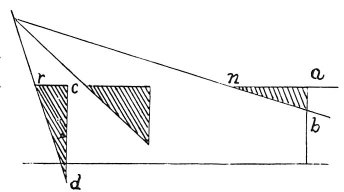

  
[Intangible Textual Heritage](../../index)  [Age of Reason](../index.md) 
[Index](index.md)   
[III. Six Books on Light and Shade Index](dvs002.md)  
  [Previous](0200)  [Next](0202.md) 

------------------------------------------------------------------------

[Buy this Book at
Amazon.com](https://www.amazon.com/exec/obidos/ASIN/0486225720/internetsacredte.md)

------------------------------------------------------------------------

*The Da Vinci Notebooks at Intangible Textual Heritage*

### 201.

p. 112

 

*A n* will be darker than *c r* in proportion to the number of times
that *a b* goes into *c d*.

------------------------------------------------------------------------

[Next: 202.](0202.md)
