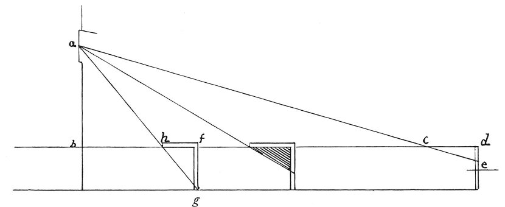

  
[Intangible Textual Heritage](../../index)  [Age of Reason](../index) 
[Index](index)   
[III. Six Books on Light and Shade Index](dvs002)  
  [Previous](0201)  [Next](0203) 

------------------------------------------------------------------------

[Buy this Book at
Amazon.com](https://www.amazon.com/exec/obidos/ASIN/0486225720/internetsacredte)

------------------------------------------------------------------------

*The Da Vinci Notebooks at Intangible Textual Heritage*

### 202.

 

The shadow cast by an object on a plane will be smaller in proportion as
that object is lighted by feebler rays. Let *d e* be the object and *d
c* the plane surface; the number of times that *d e* will go into *f g*
gives the proportion of light at *f h* to *d c*. The ray of light will
be weaker in proportion to its distance from the hole through which it
falls.

------------------------------------------------------------------------

[Next: 203.](0203)
