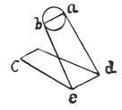

  
[Intangible Textual Heritage](../../index)  [Age of Reason](../index) 
[Index](index)   
[III. Six Books on Light and Shade Index](dvs002)  
  [Previous](0207)  [Next](0209) 

------------------------------------------------------------------------

[Buy this Book at
Amazon.com](https://www.amazon.com/exec/obidos/ASIN/0486225720/internetsacredte)

------------------------------------------------------------------------

*The Da Vinci Notebooks at Intangible Textual Heritage*

### 208.

### THE MIRROR.

 

 Experiments with the mirror (208-210).If
the illuminated object is of the same size as the luminous body and as
that in which the light is reflected, the amount of the reflected light
will bear the same proportion to the intermediate light as this second
light will bear to the first, if both bodies are smooth and white.

------------------------------------------------------------------------

[Next: 209.](0209)
