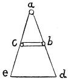

  
[Intangible Textual Heritage](../../index)  [Age of Reason](../index) 
[Index](index)   
[III. Six Books on Light and Shade Index](dvs002)  
  [Previous](0211)  [Next](0213) 

------------------------------------------------------------------------

[Buy this Book at
Amazon.com](https://www.amazon.com/exec/obidos/ASIN/0486225720/internetsacredte)

------------------------------------------------------------------------

*The Da Vinci Notebooks at Intangible Textual Heritage*

### 212.

 

### OF THE MOTION OF SHADOWS.

The motion of a shadow is always more rapid than that of the body which
produces it if the light is stationary. To prove this let *a* be the
luminous body, and *b* the body casting the shadow, and *d* the shadow.
Then I say that in the time while the solid body moves from *b* to *c*,
the shadow *d* will move to *e*; and this proportion in the rapidity of
the movements made in the same space of time, is equal to that in the
length of the space moved over. Thus, given the proportion of the space
moved over by the

p. 117

body *b* to *c*, to that moved over by the shadow *d* to *e*, the
proportion in the rapidity of their movements will be the same.

But if the luminous body is also in movement with a velocity equal to
that of the solid body, then the shadow and the body that casts it will
move with equal speed. And if the luminous body moves more rapidly than
the solid body, the motion of the shadow will be slower than that of the
body casting it.

But if the luminous body moves more slowly than the solid body, then the
shadow will move more rapidly than that body.

------------------------------------------------------------------------

[Next: 213.](0213)
