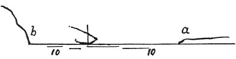

  
[Intangible Textual Heritage](../../index)  [Age of Reason](../index) 
[Index](index)   
[IV. Perspective of Disappearance Index](dvs004)  
  [Previous](0225)  [Next](0227) 

------------------------------------------------------------------------

[Buy this Book at
Amazon.com](https://www.amazon.com/exec/obidos/ASIN/0486225720/internetsacredte)

------------------------------------------------------------------------

*The Da Vinci Notebooks at Intangible Textual Heritage*

### 226.

 

 An experiment.When I was once in a place
on the sea, at an equal distance from the shore and the mountains, the
distance from the shore looked much greater than that from the
mountains.

------------------------------------------------------------------------

[Next: 227.](0227)
