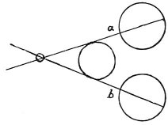

  
[Intangible Textual Heritage](../../index)  [Age of Reason](../index.md) 
[Index](index.md)   
[IV. Perspective of Disappearance Index](dvs004.md)  
  [Previous](0226)  [Next](0228.md) 

------------------------------------------------------------------------

[Buy this Book at
Amazon.com](https://www.amazon.com/exec/obidos/ASIN/0486225720/internetsacredte.md)

------------------------------------------------------------------------

*The Da Vinci Notebooks at Intangible Textual Heritage*

### 227.

 

 On indistinctness at short distances
(227-231).If you place an opaque object in front of your eye at a
distance of four fingers' breadth, if it is smaller than the space
between the two eyes it will not interfere with your seeing any thing
that may be beyond it. No object situated beyond another object seen by
the eye can be concealed by this \[nearer\] object if it is smaller than
the space from eye to eye.

------------------------------------------------------------------------

[Next: 228.](0228.md)
