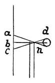

  
[Intangible Textual Heritage](../../index)  [Age of Reason](../index) 
[Index](index)   
[IV. Perspective of Disappearance Index](dvs004)  
  [Previous](0229)  [Next](0231) 

------------------------------------------------------------------------

[Buy this Book at
Amazon.com](https://www.amazon.com/exec/obidos/ASIN/0486225720/internetsacredte)

------------------------------------------------------------------------

*The Da Vinci Notebooks at Intangible Textual Heritage*

### 230.

 

### OF THE EYE.

The edges of an object placed in front of the pupil of the eye will be
less distinct in proportion as they are closer to the eye. This is shown
by the edge of the object *n* placed in front of the pupil *d*; in
looking at this edge the pupil also sees all the space *a c* which is
beyond the edge; and the images the eye receives from that space are
mingled with the images of the edge, so that one image confuses the
other, and this confusion hinders the pupil from distinguishing the
edge.

------------------------------------------------------------------------

[Next: 231.](0231)
