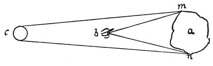

  
[Intangible Textual Heritage](../../index)  [Age of Reason](../index.md) 
[Index](index.md)   
[IV. Perspective of Disappearance Index](dvs004.md)  
  [Previous](0234)  [Next](0236.md) 

------------------------------------------------------------------------

[Buy this Book at
Amazon.com](https://www.amazon.com/exec/obidos/ASIN/0486225720/internetsacredte.md)

------------------------------------------------------------------------

*The Da Vinci Notebooks at Intangible Textual Heritage*

### 235.

 

 The importance of light and shade in the
perspective of disappearance (235-239).An opaque body seen in a
line in which the light falls will reveal no prominences to the eye. For
instance, let *a* be the solid body and *c* the light; *c m* and *c n*
will be the lines of incidence of the light, that is to say the lines
which transmit the light to the object *a*. The eye being at the point
*b*, I say

p. 132

that since the light *c* falls on the whole part *m n* the portions in
relief on that side will all be illuminated. Hence the eye placed at *c*
cannot see any light and shade and, not seeing it, every portion will
appear of the same tone, therefore the relief in the prominent or
rounded parts will not be visible.

------------------------------------------------------------------------

[Next: 236.](0236.md)
