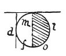

  
[Intangible Textual Heritage](../../index)  [Age of Reason](../index.md) 
[Index](index.md)   
[IV. Perspective of Disappearance Index](dvs004.md)  
  [Previous](0244)  [Next](0246.md) 

------------------------------------------------------------------------

[Buy this Book at
Amazon.com](https://www.amazon.com/exec/obidos/ASIN/0486225720/internetsacredte.md)

------------------------------------------------------------------------

*The Da Vinci Notebooks at Intangible Textual Heritage*

### 245.

### WHY BODIES IN LIGHT AND SHADE HAVE THEIR OUTLINES ALTERED BY THE COLOUR AND BRIGHTNESS OF THE OBJECTS SERVING AS A BACKGROUND TO THEM.

 

If you look at a body of which the illuminated portion lies and ends
against a dark background, that part of the light which will look
brightest will be that which lies against the dark \[background\] at
*d*. But if this brighter part lies against a light background, the edge
of the object, which is itself light, will be less distinct than before,
and the highest light will appear to be between the limit of the
background *m f* and the shadow. The same thing is seen with regard to
the dark \[side\],

p. 135

inasmuch as that edge of the shaded portion of the object which lies
against a light background, as at *l*, it looks much darker than the
rest. But if this shadow lies against a dark background, the edge of the
shaded part will appear lighter than before, and the deepest shade will
appear between the edge and the light at the point *o*.

 [115](#fn_117.md)

------------------------------------------------------------------------

### Footnotes

[135:115](0245.htm#fr_117.md) : In the original
diagram *o* is inside the shaded surface at the level of *d*.

------------------------------------------------------------------------

[Next: 246.](0246.md)
