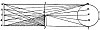

  
[Intangible Textual Heritage](../../index)  [Age of Reason](../index) 
[Index](index)   
[IV. Perspective of Disappearance Index](dvs004)  
  [Previous](0259)  [Next](0261) 

------------------------------------------------------------------------

[Buy this Book at
Amazon.com](https://www.amazon.com/exec/obidos/ASIN/0486225720/internetsacredte)

------------------------------------------------------------------------

*The Da Vinci Notebooks at Intangible Textual Heritage*

### 260.

### DIFFERENT PORTIONS OF A WALL SURFACE WILL BE DARKER OR BRIGHTER IN PROPORTION AS THE LIGHT OR SHADOW FALLS ON THEM AT A LARGER ANGLE.

The foregoing proposition can be clearly proved in this way. Let us say
that *m q* is the luminous body, then *f g* will be the opaque

[  
Click to enlarge](img/v113800.jpg)

body; and let *a e* be the above-mentioned plane on which the said
angles fall, showing \[plainly\] the nature and character of their
bases. Then: *a* will be more luminous than *b*; the base of the angle
*a* is larger than that of *b* and it therefore makes a greater angle
which will be *a m q*; and the pyramid *b p m* will be narrower and *m o
c* will be still finer, and so on by degrees, in proportion as they are
nearer to *e*, the pyramids will become narrower and darker. That
portion of the wall will be the darkest where the breadth of the

p. 139

pyramid of shadow is greater than the breadth of the pyramid of light.

At the point *a* the pyramid of light is equal in strength to the
pyramid of shadow, because the base *f g* is equal to the base *r f*. At
the point *d* the pyramid of light is narrower than the pyramid of
shadow by so much as the base *s f* is less than the base *f g*.

Divide the foregoing proposition into two diagrams, one with the
pyramids of light and shadow, the other with the pyramids of light
\[only\].

------------------------------------------------------------------------

[Next: 261.](0261)
