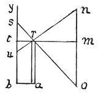

  
[Intangible Textual Heritage](../../index)  [Age of Reason](../index.md) 
[Index](index.md)   
[V. Theory of Colours Index](dvs005.md)  
  [Previous](0269)  [Next](0271.md) 

------------------------------------------------------------------------

[Buy this Book at
Amazon.com](https://www.amazon.com/exec/obidos/ASIN/0486225720/internetsacredte.md)

------------------------------------------------------------------------

*The Da Vinci Notebooks at Intangible Textual Heritage*

### 270.

### OF THE RAYS WHICH CONVEY THROUGH THE AIR THE IMAGES OF OBJECTS.

All the minutest parts of the image intersect each other without
interfering with

p. 145

 

each other. To prove this let *r* be one of the sides of the hole,
opposite to which let *s* be the eye which sees the lower end *o* of the
line *n o*. The other extremity cannot transmit its image to the eye *s*
as it has to strike the end *r* and it is the same with regard to *m* at
the middle of the line. The case is the same with the upper extremity
*n* and the eye *u*. And if the end *n* is red the eye *u* on that side
of the holes will not see the green colour of *o*, but only the red of
*n* according to the 7th of this where it is said: Every form projects
images from itself by the shortest line, which necessarily is a straight
line, &c

 [119](#fn_121.md)

------------------------------------------------------------------------

### Footnotes

[145:119](0270.htm#fr_121.md) : 13. This probably
refers to the diagram given under No. 66.

------------------------------------------------------------------------

[Next: 271.](0271.md)
