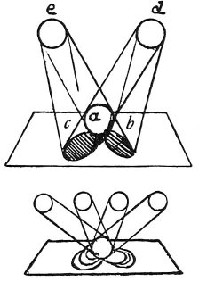

  
[Intangible Textual Heritage](../../index)  [Age of Reason](../index.md) 
[Index](index.md)   
[V. Theory of Colours Index](dvs005.md)  
  [Previous](0271)  [Next](0273.md) 

------------------------------------------------------------------------

[Buy this Book at
Amazon.com](https://www.amazon.com/exec/obidos/ASIN/0486225720/internetsacredte.md)

------------------------------------------------------------------------

*The Da Vinci Notebooks at Intangible Textual Heritage*

### 272.

 Combination of different colours in cast
shadows.That which casts the shadow does not face it, because the
shadows are produced by the light which causes and surrounds the
shadows. The shadow caused by the light *e*,

p. 146

 

which is yellow, has a blue tinge, because the shadow of the body *a* is
cast upon the pavement at *b*, where the blue light falls; and the
shadow produced by the light *d*, which is blue, will be yellow at *c*,
because the yellow light falls there and the surrounding background to
these shadows *b c* will, besides its natural colour, assume a hue
compounded of yellow and blue, because it is lighted by the yellow light
and by the blue light both at once.

Shadows of various colours, as affected by the lights falling on them.
That light which causes the shadow does not face it.

 [120](#fn_122.md)

------------------------------------------------------------------------

### Footnotes

[146:120](0272.htm#fr_122.md) : In the original
diagram we find in the circle *e* "*giallo*" (yellow) and the cirle *d*
"*azurro"* (blue) and also under the circle of shadow to the left
"*giallo*" is written and under that to the right "*azurro*".

In the second diagram where four circles are placed in a row we find
written, beginning at the left hand, "*giallo*" (yellow), "*azurro*"
(blue), "*verde*" (green), "*rosso*" (red).

------------------------------------------------------------------------

[Next: 273.](0273.md)
