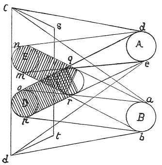

  
[Intangible Textual Heritage](../../index)  [Age of Reason](../index.md) 
[Index](index.md)   
[V. Theory of Colours Index](dvs005.md)  
  [Previous](0275)  [Next](0277.md) 

------------------------------------------------------------------------

[Buy this Book at
Amazon.com](https://www.amazon.com/exec/obidos/ASIN/0486225720/internetsacredte.md)

------------------------------------------------------------------------

*The Da Vinci Notebooks at Intangible Textual Heritage*

### 276.

 

### OF THE COLOURS OF SIMPLE DERIVED SHADOWS.

The colour of derived shadows is always affected by that of the body
towards which they are cast. To prove this: let an opaque body be placed
between the plane *s c t d* and the blue light *d e* and the red light
*a b*, then I say that *d e*, the blue light, will fall on the whole
surface *s c t d* excepting at *o p* which is covered by the shadow of
the body *q r*, as is shown by the straight lines *d q o e r p*. And the
same occurs with the light *a b* which falls on the whole surface *s c t
d* excepting at the spot obscured by the shadow *q r*; as is shown by
the lines *d q o*, and *e r p*. Hence we may conclude that the shadow *n
m* is exposed to the blue light

p. 149

*d e*; but, as the red light *a b* cannot fall there, *n m* will appear
as a blue shadow on a red background tinted with blue, because on the
surface *s c t d* both lights can fall. But in the shadows only one
single light falls; for this reason these shadows are of medium depth,
since, if no light whatever mingled with the shadow, it would be of the
first degree of darkness &c But in the shadow at *o p* the blue light
does not fall, because the body *q r* interposes and intercepts it
there. Only the red light *a b* falls there and tinges the shadow of a
red hue and so a ruddy shadow appears on the background of mingled red
and blue.

The shadow of *q r* at *o p* is red, being caused by the blue light *d
e*; and the shadow of *q r* at *o' p'* is blue being caused by the red
light *a b*. Hence we say that the blue light in this instance causes a
red derived shadow from the opaque body *q' r'*, while the red light
causes the same body to cast a blue derived shadow; but the primary
shadow \[on the dark side of the body itself\] is not of either of those
hues, but a mixture of red and blue.

The derived shadows will be equal in depth if they are produced by
lights of equal strength and at an equal distance; this is proved.
 [122](#fn_124.md)

 [123](#fn_125.md)

------------------------------------------------------------------------

### Footnotes

[149:122](0276.htm#fr_124.md) 53: The text is
unfinished in the original.

[149:123](0276.htm#fr_125.md) : In the original
diagram Leonardo has written within the circle *q r corpo obroso* (body
in shadow); at the spot marked *A, luminoso azzurro* (blue luminous
body); at *B, luminoso rosso* (red luminous body). At *E* we read *ombra
azzurra* (blue tinted shadow) and at *D ombra rossa* (red tinted
shadow).

------------------------------------------------------------------------

[Next: 277.](0277.md)
