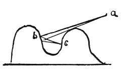

  
[Intangible Textual Heritage](../../index)  [Age of Reason](../index.md) 
[Index](index.md)   
[V. Theory of Colours Index](dvs005.md)  
  [Previous](0282)  [Next](0284.md) 

------------------------------------------------------------------------

[Buy this Book at
Amazon.com](https://www.amazon.com/exec/obidos/ASIN/0486225720/internetsacredte.md)

------------------------------------------------------------------------

*The Da Vinci Notebooks at Intangible Textual Heritage*

### 283.

 

### WHAT PORTION OF A COLOURED SURFACE OUGHT IN REASON TO BE THE MOST

### INTENSE.

If *a* is the light, and *b* illuminated by it in a direct line, *c*, on
which the light cannot fall, is lighted only by reflection from *b*
which, let us say, is red. Hence the light reflected from it, will be
affected by the hue of the surface causing it and will tinge the surface
*c* with red. And if *c* is also red you will see it much more intense
than *b*; and if it were yellow you would see there a colour between
yellow and red.

------------------------------------------------------------------------

[Next: 284.](0284.md)
