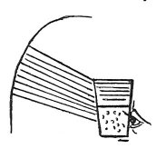

  
[Intangible Textual Heritage](../../index)  [Age of Reason](../index.md) 
[Index](index.md)   
[V. Theory of Colours Index](dvs005.md)  
  [Previous](0287)  [Next](dv10331.md) 

------------------------------------------------------------------------

[Buy this Book at
Amazon.com](https://www.amazon.com/exec/obidos/ASIN/0486225720/internetsacredte.md)

------------------------------------------------------------------------

*The Da Vinci Notebooks at Intangible Textual Heritage*

### 288.

p. 153

 

### WHETHER THE COLOURS OF THE RAINBOW ARE PRODUCED BY THE SUN.

The colours of the rainbow are not produced by the sun, for they occur
in many ways without the sunshine; as may be seen by holding a glass of
water up to the eye; when, in the glass--where there are those minute
bubbles always seen in coarse glass--each bubble, even though the sun
does not fall on it, will produce on one side all the colours of the
rainbow; as you may see by placing the glass between the day light and
your eye in such a way as that it is close to the eye, while on one side
the glass admits the \[diffused\] light of the atmosphere, and on the
other side the shadow of the wall on one side of the window; either left
or right, it matters not which. Then, by turning the glass round you
will see these colours all round the bubbles in the glass &c And the
rest shall be said in its place.

### THAT THE EYE HAS NO PART IN PRODUCING THE COLOURS OF THE RAINBOW.

 

In the experiment just described, the eye would seem to have some share
in the colours of the rainbow, since these bubbles in the glass do not
display the colours except through the medium of the eye. But, if you
place the glass full of water on the window sill, in such a position as
that the outer side is exposed to the sun's rays, you will see the same
colours produced in the spot of light thrown through the glass and upon
the floor, in a dark place, below the window; and as the eye is not here
concerned in it, we may evidently, and with certainty pronounce that the
eye has no share in producing them.

p. 154

### OF THE COLOURS IN THE FEATHERS OF CERTAIN BIRDS.

There are many birds in various regions of the world on whose feathers
we see the most splendid colours produced as they move, as we see in our
own country in the feathers of peacocks or on the necks of ducks or
pigeons, &c

Again, on the surface of antique glass found underground and on the
roots of turnips kept for some time at the bottom of wells or other
stagnant waters \[we see\] that each root displays colours similar to
those of the real rainbow. They may also be seen when oil has been
placed on the top of water and in the solar rays reflected from the
surface of a diamond or beryl; again, through the angular facet of a
beryl every dark object against a background of the atmosphere or any
thing else equally pale-coloured is surrounded by these rainbow colours
between the atmosphere and the dark body; and in many other
circumstances which I will not mention, as these suffice for my purpose.

------------------------------------------------------------------------

[Next: Introduction](dv10331.md)
