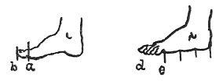

  
[Intangible Textual Heritage](../../index)  [Age of Reason](../index.md) 
[Index](index.md)   
[VII. On the Proportions and on the Movements of the Human Figure
Index](dvs007.md)  
  [Previous](0321)  [Next](0323.md) 

------------------------------------------------------------------------

[Buy this Book at
Amazon.com](https://www.amazon.com/exec/obidos/ASIN/0486225720/internetsacredte.md)

------------------------------------------------------------------------

*The Da Vinci Notebooks at Intangible Textual Heritage*

### 322.

 

The great toe is the sixth part of the foot, taking the measure in
profile, on the inside of the foot, from where this toe springs from the
ball of the sole of the foot to its tip *a b*; and it is equal to the
distance from the mouth to the bottom of the chin. If you draw the foot
in profile from the outside, make the little toe begin at three quarters
of the length of the foot, and you will find the same distance from the
insertion of this toe as to the farthest prominence of the great toe.

------------------------------------------------------------------------

[Next: 323.](0323.md)
