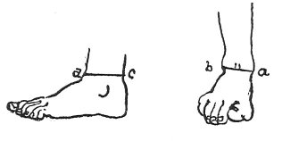

  
[Intangible Textual Heritage](../../index)  [Age of Reason](../index) 
[Index](index)   
[VII. On the Proportions and on the Movements of the Human Figure
Index](dvs007)  
  [Previous](0322)  [Next](0324) 

------------------------------------------------------------------------

[Buy this Book at
Amazon.com](https://www.amazon.com/exec/obidos/ASIN/0486225720/internetsacredte)

------------------------------------------------------------------------

*The Da Vinci Notebooks at Intangible Textual Heritage*

### 323.

p. 175

 

For each man respectively the distance between *a b* is equal to *c d*.

------------------------------------------------------------------------

[Next: 324.](0324)
