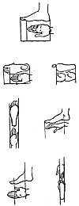
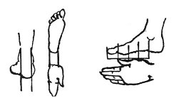
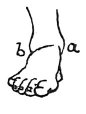

  
[Intangible Textual Heritage](../../index)  [Age of Reason](../index.md) 
[Index](index.md)   
[VII. On the Proportions and on the Movements of the Human Figure
Index](dvs007.md)  
  [Previous](0323)  [Next](0325.md) 

------------------------------------------------------------------------

[Buy this Book at
Amazon.com](https://www.amazon.com/exec/obidos/ASIN/0486225720/internetsacredte.md)

------------------------------------------------------------------------

*The Da Vinci Notebooks at Intangible Textual Heritage*

### 324.

[  
Click to enlarge](img/v117501.jpg.md)

 Relative proportion of the hand and
foot.The foot is as much longer than the hand as the thickness of
the arm at the wrist where it is thinnest seen facing.

Again, you will find that the foot is as much longer than the hand as
the space between the inner angle of the little toe to the last
projection of the big toe, if you measure along the length of the foot.

The palm of the hand without the fingers goes twice into the length of
the foot without the toes.

If you hold your hand with the fingers straight out and close together
you will find it to be of the same width as the widest part of the foot,
that is where it is joined onto the toes.

And if you measure from the prominence of the inner ancle to the end of
the great toe you will find this measure to be as long as the whole
hand.

From the top angle of the foot to the insertion of the toes is equal to
the hand from wrist joint to the tip of the thumb.

The smallest width of the hand is equal to the smallest width of the
foot between its joint into the leg and the insertion of the toes.

The width of the heel at the lower part is equal to that of the arm
where it joins the hand; and also to the leg

p. 176

where it is thinnest when viewed in front.

 

The length of the longest toe, from its first division from the great
toe to its tip is the fourth of the foot from the centre of the ancle
bone to the tip, and it is equal to the width of the mouth. The distance
between the mouth and the chin is equal to that of the knuckles and of
the three middle fingers and to the length of their first joints if the
hand is spread, and equal to the distance from the joint of the thumb to
the outset of the nails, that is the fourth part of the hand and of the
face.

 

The space between the extreme poles inside and outside the foot called
the ancle or ancle bone *a b* is equal to the space between the mouth
and the inner corner of the eye.

------------------------------------------------------------------------

[Next: 325.](0325.md)
