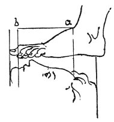

  
[Intangible Textual Heritage](../../index)  [Age of Reason](../index) 
[Index](index)   
[VII. On the Proportions and on the Movements of the Human Figure
Index](dvs007)  
  [Previous](0324)  [Next](0326) 

------------------------------------------------------------------------

[Buy this Book at
Amazon.com](https://www.amazon.com/exec/obidos/ASIN/0486225720/internetsacredte)

------------------------------------------------------------------------

*The Da Vinci Notebooks at Intangible Textual Heritage*

### 325.

 

 Relative proportions of the foot and of the face
(325--327).The foot, from where it is attached to the leg, to the
tip of the great toe is as long as the space between the upper part of
the chin and the roots of the hair *a b*; and equal to five sixths of
the face.

------------------------------------------------------------------------

[Next: 326.](0326)
