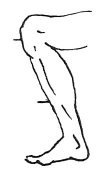

  
[Intangible Textual Heritage](../../index)  [Age of Reason](../index) 
[Index](index)   
[VII. On the Proportions and on the Movements of the Human Figure
Index](dvs007)  
  [Previous](0328)  [Next](0330) 

------------------------------------------------------------------------

[Buy this Book at
Amazon.com](https://www.amazon.com/exec/obidos/ASIN/0486225720/internetsacredte)

------------------------------------------------------------------------

*The Da Vinci Notebooks at Intangible Textual Heritage*

### 329.

 

The length of the foot from the end of the toes to the heel goes twice
into that from the heel to the knee, that is where the leg bone
\[fibula\] joins the thigh bone \[femur\].

------------------------------------------------------------------------

[Next: 330.](0330)
