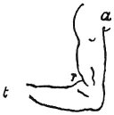
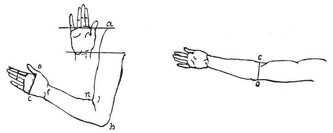

  
[Intangible Textual Heritage](../../index)  [Age of Reason](../index.md) 
[Index](index.md)   
[VII. On the Proportions and on the Movements of the Human Figure
Index](dvs007.md)  
  [Previous](0347)  [Next](0349.md) 

------------------------------------------------------------------------

[Buy this Book at
Amazon.com](https://www.amazon.com/exec/obidos/ASIN/0486225720/internetsacredte.md)

------------------------------------------------------------------------

*The Da Vinci Notebooks at Intangible Textual Heritage*

### 348.

p. 184

*a b* goes 4 times into *a c* and 9 into *a m*. The greatest thickness
of the arm between the elbow and the hand goes 6 times into *a m* and is
equal to *r f*. The greatest thickness of the arm between the shoulder
and the elbow goes 4 times into *c m*, and is equal to *h n g*. The
smallest thickness of the arm above the elbow *x y* is not the base of a
square, but is equal to half the space *h* 3 which is found between the
inner joint of the arm and the wrist joint.

\[11\]The width of the wrist goes 12 times into the whole arm; that is
from the tip of the fingers to the shoulder joint; that is 3 times into
the hand and 9 into the arm.

The arm when bent is 4 heads.

The arm from the shoulder to the elbow in bending increases in length,
that is in the length from the shoulder to the elbow, and this increase
is equal to the thickness of the arm at the wrist when seen in profile.
And the space between the bottom of the chin and the parting of the
lips, is equal to the thickness of the 2 middle fingers, and to the
width of the mouth and to the space between the roots of the hair on the
forehead and the top of the head  [167](#fn_169.md) . All these distances are equal to
each other, but they are not equal to the above-mentioned increase in
the arm.

The arm between the elbow and wrist never increases by being bent or
extended.

The arm, from the shoulder to the inner joint when extended.

When the arm is extended, *p n* is equal to *n a*. And when it is bent
*n a* diminishes 1/6 of its length and *p n* does the same. The outer
elbow joint increases 1/7 when bent; and thus by being bent it increases
to the length of 2 heads. And on the inner

p. 185

side, by bending, it is found that whereas the arm from where it joins
the side to the wrist, was 2 heads and a half, in bending it loses the
half head and measures only two: one from the \[shoulder\] joint to the
end \[by the elbow\], and the other to the hand.

 

The arm when folded will measure 2 faces up to the shoulder from the
elbow and 2 from the elbow to the insertion of the four fingers on the
palm of the hand. The length from the base of the fingers to the elbow
never alters in any position of the arm.

If the arm is extended it decreases by 1/3 of the length between *b* and
*h*; and if--being extended--it is bent, it will increase

 

the half of *o e*.  [168](#fn_170.md) The length
from the shoulder to the elbow is the same as from the base of the
thumb, inside, to the elbow *a b c*.

 [169](#fn_171.md) The smallest thickness of the
arm in profile *z c* goes 6 times between the knuckles of the hand and
the dimple of the elbow when extended and 14 times in the whole arm and
42 in the whole man \[64\]. The greatest thickness of the arm in profile
is equal to the greatest thickness of the arm in front; but the first is
placed at a third of the arm from the shoulder joint to the elbow and
the other at a third from the elbow towards the hand.

 [170](#fn_172.md)

------------------------------------------------------------------------

### Footnotes

[184:167](0348.htm#fr_169.md) : *Queste cose*.
This passage seems to have been written on purpose to rectify the
foregoing lines. The error is explained by the accompanying sketch of
the bones of the arm.

[185:168](0348.htm#fr_170.md) 59-61: The figure
sketched in the margin is however drawn to different proportions.

[185:169](0348.htm#fr_171.md) 62-64: The arm
sketch on the margin of the MS. is identically the same as that given
below on [Pl. XX](pl020.htm#img_pl020.md) which may therefore be referred
to in this place. In line 62 we read therefore *z c* for *m n*.

[185:170](0348.htm#fr_172.md) : Compare [Pl.
XVII](pl017.htm#img_pl017.md). Lines 1-10 and 11-15 are written in two
columns below the extended arm, and at the tips of the fingers we find
the words: *fine d'unghie* (ends of the nails). Part of the text--lines
22 to 25--is visible by the side of the sketches on [Pl.
XXXV](pl035.htm#img_pl035.md), No. 1.

------------------------------------------------------------------------

[Next: 349.](0349.md)
