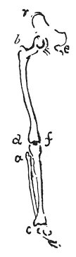

  
[Intangible Textual Heritage](../../index)  [Age of Reason](../index) 
[Index](index)   
[VII. On the Proportions and on the Movements of the Human Figure
Index](dvs007)  
  [Previous](0364)  [Next](0366) 

------------------------------------------------------------------------

[Buy this Book at
Amazon.com](https://www.amazon.com/exec/obidos/ASIN/0486225720/internetsacredte)

------------------------------------------------------------------------

*The Da Vinci Notebooks at Intangible Textual Heritage*

### 365.

### OF PAINTING.

Which are the muscles which subdivide in old age or in youth, when
becoming lean? Which are the parts of the limbs of the human frame where
no amount of fat makes the flesh thicker, nor any degree of leanness
ever diminishes it?

The thing sought for in this question will be found in all the external
joints of the bones, as the shoulder, elbow, wrists, finger-joints,
hips, knees, ankle-bone and toes and the like; all of which shall be
told in its place. The greatest thickness acquired by any limb is at the
part of the muscles which is farthest from its attachments.

Flesh never increases on those portions of the limb where the bones are
near to the surface.

p. 192

 

At *b r d a c e f* the increase or diminution of the flesh never makes
any considerable difference. Nature has placed in front of man all those
parts which feel most pain under a blow; and these are the shin of the
leg, the forehead, and the nose. And this was done for the preservation
of man, since, if such pain were not felt in these parts, the number of
blows to which they would be exposed must be the cause of their
destruction.

Describe why the bones of the arm and leg are double near the hand and
foot \[respectively\].

And where the flesh is thicker or thinner in the bending of the limbs.

------------------------------------------------------------------------

[Next: 366.](0366)
