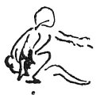

  
[Intangible Textual Heritage](../../index)  [Age of Reason](../index.md) 
[Index](index.md)   
[VII. On the Proportions and on the Movements of the Human Figure
Index](dvs007.md)  
  [Previous](0369)  [Next](0371.md) 

------------------------------------------------------------------------

[Buy this Book at
Amazon.com](https://www.amazon.com/exec/obidos/ASIN/0486225720/internetsacredte.md)

------------------------------------------------------------------------

*The Da Vinci Notebooks at Intangible Textual Heritage*

### 370.

 

How a man proceeds to raise himself to his feet, when he is sitting on
level ground.

------------------------------------------------------------------------

[Next: 371.](0371.md)
