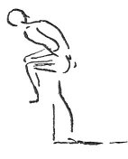

  
[Intangible Textual Heritage](../../index)  [Age of Reason](../index) 
[Index](index)   
[VII. On the Proportions and on the Movements of the Human Figure
Index](dvs007)  
  [Previous](0377)  [Next](0379) 

------------------------------------------------------------------------

[Buy this Book at
Amazon.com](https://www.amazon.com/exec/obidos/ASIN/0486225720/internetsacredte)

------------------------------------------------------------------------

*The Da Vinci Notebooks at Intangible Textual Heritage*

### 378.

The sinew which guides the leg, and which is connected with the patella
of the knee, feels it a greater labour to carry the man upwards, in
proportion as the leg is more bent; and the muscle which acts

p. 197

 

upon the angle made by the thigh where it joins the body has less
difficulty and has a less weight to lift, because it has not the
\[additional\] weight of the thigh itself. And besides this it has
stronger muscles, being those which form the buttock.

------------------------------------------------------------------------

[Next: 379.](0379)
