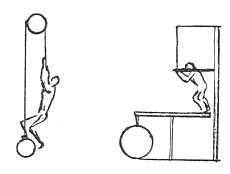

  
[Intangible Textual Heritage](../../index)  [Age of Reason](../index) 
[Index](index)   
[VII. On the Proportions and on the Movements of the Human Figure
Index](dvs007)  
  [Previous](0382)  [Next](0384) 

------------------------------------------------------------------------

[Buy this Book at
Amazon.com](https://www.amazon.com/exec/obidos/ASIN/0486225720/internetsacredte)

------------------------------------------------------------------------

*The Da Vinci Notebooks at Intangible Textual Heritage*

### 383.

### OF THE STRENGTH OF MAN.

 

A man pulling a \[dead\] weight balanced against himself cannot pull
more than his own weight. And if he has to raise it he will \[be able
to\] raise as much more than his weight as his strength may be more than
that of other men.  [190](#fn_192) The greatest
force a man can apply, with equal velocity and impetus, will be when he
sets his feet on one end of the balance \[or lever\] and then presses
his shoulders against some stable body. This will raise a weight at the
other end of the balance \[lever\], equal to his own weight and \[added
to that\] as much weight as he can carry on his shoulders.

------------------------------------------------------------------------

### Footnotes

[198:190](0383.htm#fr_192) 7: The stroke at the
end of this line finishes in the original in a sort of loop or flourish,
and a similar flourish occurs at the end of the previous passage written
on the same page. M. RAVAISSON regards these as numbers (compare the
photograph of page 30b in his edition of MS. A). He remarks: "*Ce
chiffre* 8 *et, a la fin de l'alinea precedent, le chiffre* 7 *sont,
dans le manuscrit, des renvois*."

------------------------------------------------------------------------

[Next: 384.](0384)
