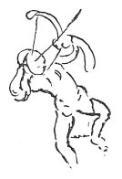

  
[Intangible Textual Heritage](../../index)  [Age of Reason](../index) 
[Index](index)   
[VII. On the Proportions and on the Movements of the Human Figure
Index](dvs007)  
  [Previous](0384)  [Next](0386) 

------------------------------------------------------------------------

[Buy this Book at
Amazon.com](https://www.amazon.com/exec/obidos/ASIN/0486225720/internetsacredte)

------------------------------------------------------------------------

*The Da Vinci Notebooks at Intangible Textual Heritage*

### 385.

 

A man who wants to send an arrow very far from the bow must be standing
entirely on one foot and raising the other so far from the foot he
stands on as to afford the requisite counterpoise to his body which is
thrown on the front foot. And he must not hold his arm fully extended,
and in order that he may be more able to bear the

p. 199

strain he must hold a piece of wood which there is in all crossbows,
extending from the hand to the breast, and when he wishes to shoot he
suddenly leaps forward at the same instant and extends his arm with the
bow and releases the string. And if he dexterously does every thing at
once it will go a very long way.

------------------------------------------------------------------------

[Next: 386.](0386)
