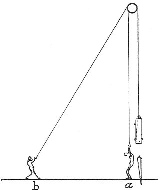

  
[Intangible Textual Heritage](../../index)  [Age of Reason](../index) 
[Index](index)   
[VII. On the Proportions and on the Movements of the Human Figure
Index](dvs007)  
  [Previous](0391)  [Next](pl036) 

------------------------------------------------------------------------

[Buy this Book at
Amazon.com](https://www.amazon.com/exec/obidos/ASIN/0486225720/internetsacredte)

------------------------------------------------------------------------

*The Da Vinci Notebooks at Intangible Textual Heritage*

### 392.

 

You ought not to give to drapery a great confusion of many folds, but
rather only introduce them where they are held by the hands or the arms;
the rest you may let fall simply where it is its nature to flow; and do
not let the nude forms be broken by too many details and interrupted
folds. How draperies should be drawn from nature: that is to say if
youwant to represent woollen cloth draw the folds from that; and if it
is to be silk, or fine cloth or coarse, or of linen or of crape, vary
the folds in each and do not represent dresses, as many do, from models
covered with paper or thin leather which will deceive you greatly.

 [199](#fn_201)

------------------------------------------------------------------------

### Footnotes

[201:199](0392.htm#fr_201) : The little pen and
ink drawing from Windsor (W. 102), given on [Pl.
XXVIII](pl028.htm#img_pl028), No. 7, clearly illustrates the statement
made at the beginning of this passage; the writing of the cipher 19 on
the same page is in Leonardo's hand; the cipher 21 is certainly not.

------------------------------------------------------------------------

[Next: Plate XXXVI](pl036)
