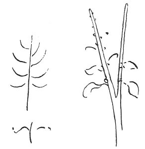

  
[Intangible Textual Heritage](../../index)  [Age of Reason](../index) 
[Index](index)   
[VIII. Botany for Painters and Elements of Landscape Painting
Index](dvs009)  
  [Previous](0403)  [Next](0405) 

------------------------------------------------------------------------

[Buy this Book at
Amazon.com](https://www.amazon.com/exec/obidos/ASIN/0486225720/internetsacredte)

------------------------------------------------------------------------

*The Da Vinci Notebooks at Intangible Textual Heritage*

### 404.

 

The tips of the boughs of plants \[and trees\], unless they are borne
down by the weight of their fruits, turn towards the sky as much as
possible.

The upper side of their leaves is turned towards the sky that it may
receive the nourishment of the dew which falls at night.

The sun gives spirit and life to plants and the earth nourishes them
with moisture. \[9\] With regard to this I made the experiment of
leaving only one small root on a gourd and this I kept nourished with
water, and the gourd brought to perfection all the fruits it could
produce, which were about 60 gourds of the long kind, andi set my mind
diligently \[to consider\] this vitality and perceived that the dews of
night were what supplied it abundantly with moisture through the
insertion of its large leaves and gave nourishment to the plant and its
offspring--or the seeds which its offspring had to produce--\[21\].

The rule of the leaves produced on the last shoot of the year will be
that they will grow in a contrary direction on the twin branches; that
is, that the insertion of the leaves turns round each branch in such a

p. 209

way, as that the sixth leaf above is produced over the sixth leaf below,
and the way they turn is that if one turns towards its companion to the
right, the other turns to the left, the leaf serving as the nourishing
breast for the shoot or fruit which grows the following year.

 [205](#fn_207)

------------------------------------------------------------------------

### Footnotes

[209:205](0404.htm#fr_207) : A French
translation of lines 9-12 was given by M. RAVAISSON in the *Gazette des
Beaux Arts*, Oct. 1877; his paper also contains some valuable
information as to botanical science in the ancient classical writers and
at the time of the Renaissance.

------------------------------------------------------------------------

[Next: 405.](0405)
