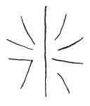

  
[Intangible Textual Heritage](../../index)  [Age of Reason](../index.md) 
[Index](index.md)   
[VIII. Botany for Painters and Elements of Landscape Painting
Index](dvs009.md)  
  [Previous](0404)  [Next](0406.md) 

------------------------------------------------------------------------

[Buy this Book at
Amazon.com](https://www.amazon.com/exec/obidos/ASIN/0486225720/internetsacredte.md)

------------------------------------------------------------------------

*The Da Vinci Notebooks at Intangible Textual Heritage*

### 405.

 

The lowest branches of those trees which have large leaves and heavy
fruits, such as nut-trees, fig-trees and the like, always droop towards
the ground.

The branches always originate above \[in the axis of\] the leaves.

------------------------------------------------------------------------

[Next: 406.](0406.md)
