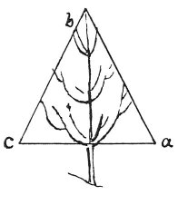

  
[Intangible Textual Heritage](../../index)  [Age of Reason](../index) 
[Index](index)   
[VIII. Botany for Painters and Elements of Landscape Painting
Index](dvs009)  
  [Previous](0409)  [Next](0411) 

------------------------------------------------------------------------

[Buy this Book at
Amazon.com](https://www.amazon.com/exec/obidos/ASIN/0486225720/internetsacredte)

------------------------------------------------------------------------

*The Da Vinci Notebooks at Intangible Textual Heritage*

### 410.

The cherry-tree is of the character of the fir tree as regards its
ramification placed

p. 211

 

in stages round its main stem; and its branches spring, 4 or five or 6
\[together\] opposite each other; and the tips of the topmost shoots
form a pyramid from the middle upwards; and the walnut and oak form a
hemisphere from the middle upwards.

------------------------------------------------------------------------

[Next: 411.](0411)
