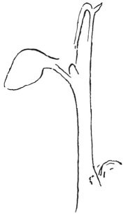
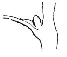

  
[Intangible Textual Heritage](../../index)  [Age of Reason](../index.md) 
[Index](index.md)   
[VIII. Botany for Painters and Elements of Landscape Painting
Index](dvs009.md)  
  [Previous](0414)  [Next](0416.md) 

------------------------------------------------------------------------

[Buy this Book at
Amazon.com](https://www.amazon.com/exec/obidos/ASIN/0486225720/internetsacredte.md)

------------------------------------------------------------------------

*The Da Vinci Notebooks at Intangible Textual Heritage*

### 415.

p. 213

 

### OF THE INSERTION OF THE LEAVES ON THE BRANCHES.

The thickness of a branch never diminishes within the space between one
leaf and the next excepting by so much as the thickness of the bud which
is above the leaf and this thickness is taken off from the branch above
\[the node\] as far as the next leaf.

 

Nature has so placed the leaves of the latest shoots of many plants that
the sixth leaf is always above the first, and so on in succession, if
the rule is not \[accidentally\] interfered with; and this occurs for
two useful ends in the plant: First that as the shoot and the fruit of
the following year spring from the bud or eye which lies above and in
close contact with the insertion of the leaf \[in the axil\], the water
which falls upon the shoot can run down to nourish the bud, by the drop
being caught in the hollow \[axil\] at the insertion of the leaf. And
the second advantage is, that as these shoots develop in the following
year one will not cover the next below, since the 5 come forth on five
different sides; and the sixth which is above the first is at some
distance.

------------------------------------------------------------------------

[Next: 416.](0416.md)
