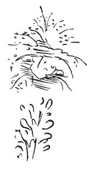

  
[Intangible Textual Heritage](../../index)  [Age of Reason](../index.md) 
[Index](index.md)   
[VIII. Botany for Painters and Elements of Landscape Painting
Index](dvs009.md)  
  [Previous](0415)  [Next](0417.md) 

------------------------------------------------------------------------

[Buy this Book at
Amazon.com](https://www.amazon.com/exec/obidos/ASIN/0486225720/internetsacredte.md)

------------------------------------------------------------------------

*The Da Vinci Notebooks at Intangible Textual Heritage*

### 416.

 

### OF THE RAMIFICATIONS OF TREES AND THEIR FOLIAGE.

The ramifications of any tree, such as the elm, are wide and slender
after the manner of a hand with spread fingers, foreshortened. And these
are seen in the distribution \[thus\]: the lower portions are seen from
above; and those that are above are seen from below; and those in the
middle, some from below and some from above. The upper part is the
extreme \[top\] of this ramification and the middle portion is more
foreshortened than any other of those which are turned with their tips
towards you. And of those parts of the middle of

p. 214

the height of the tree, the longest will be towards the top of the tree
and will produce a ramification like the foliage of the common willow,
which grows on the banks of rivers.

Other ramifications are spherical, as those of such trees as put forth
their shoots and leaves in the order of the sixth being placed above the
first. Others are thin and light like the willow and others.

------------------------------------------------------------------------

[Next: 417.](0417.md)
