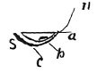

  
[Intangible Textual Heritage](../../index)  [Age of Reason](../index) 
[Index](index)   
[VIII. Botany for Painters and Elements of Landscape Painting
Index](dvs009)  
  [Previous](0422)  [Next](0424) 

------------------------------------------------------------------------

[Buy this Book at
Amazon.com](https://www.amazon.com/exec/obidos/ASIN/0486225720/internetsacredte)

------------------------------------------------------------------------

*The Da Vinci Notebooks at Intangible Textual Heritage*

### 423.

 

### OF THE SHADOWS OF A LEAF.

 The proportions of light and shade in a leaf
(423-426).Sometimes a leaf has three accidents \[of light\] that
is: shade, lustre \[reflected light\] and transparency \[transmitted
light\]. Thus, if the light were at *n* as regards the leaf *s*, and the
eye at *m*, it would see *a* in full light, *b* in shadow and *c*
transparent.

------------------------------------------------------------------------

[Next: 424.](0424)
