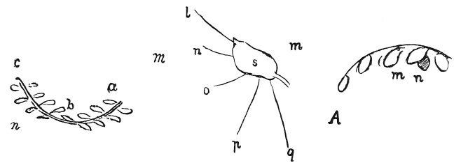

  
[Intangible Textual Heritage](../../index)  [Age of Reason](../index.md) 
[Index](index.md)   
[VIII. Botany for Painters and Elements of Landscape Painting
Index](dvs009.md)  
  [Previous](0430)  [Next](0432.md) 

------------------------------------------------------------------------

[Buy this Book at
Amazon.com](https://www.amazon.com/exec/obidos/ASIN/0486225720/internetsacredte.md)

------------------------------------------------------------------------

*The Da Vinci Notebooks at Intangible Textual Heritage*

### 431.

p. 218

If the light comes from *m* and the eye is at *n* the eye will see the
colour of the leaves *a b* all affected by the colour of *m* --that is
of the atmosphere; and *b c* will be seen from the under side as
transparent, with a beautiful green colour verging on yellow.

 

If *m* is the luminous body lighting up the leaf *s* all the eyes that
see the under side of this leaf will see it of a beautiful light green,
being transparent.

In very many cases the positions of the leaves will be without shadow
\[or in full light\], and their under side will be transparent and the
right side lustrous \[reflecting light\].

------------------------------------------------------------------------

[Next: 432.](0432.md)
